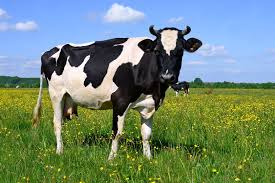

# Context

This project has two goals - (1) How to deploy machine learning algorithm to production and 
make it to work as serverless function to get best scalability and (2) Explore OpenFaaS and 
related tools to develop, test and deploy onto public cloud providers such as Azure, AWS and Google Cloud.

The purpose of our OpenFaaS Function is to classify an animal image with predictions up to 3 different animals with probabilities.

* use a deep learning convolutional neural network model in **Keras** with tensorflow for image recognition and classification
* use a serverless function deployed by **OpenFaaS** in the docker image.

Detailed documentation for this project can be reviewed [HERE](https://github.com/cloudmesh-community/fa18-516-11/blob/master/project-report/report.md).

This section describes how to build and deploy a microservice - OpenFaaS function for classifying an animal image. 


## Install Docker Swarm (Single-Node Cluster), Docker and OpenFaaS

* **Prerequisites:** Windows 10 Professional or Enterprise Edition, open the command prompt in Administrator moode
* **Step 1:** Install Docker [Community Edition](https://store.docker.com/editions/community/docker-ce-desktop-windows)
* **Step 2:** Install Git Bash for pulling the latest OpenFaaS artifacts and all the other software from GitHub
* **Step 3:** Run **docker swarm init** to set up the single-node docker swarm cluster
* **Step 4:** Create an account with Docker Hub, if the created docker images to be shared with others through internet
* **Step 5:** Run **docker login** to make sure docker is linked to your account
* **Step 6:** Download latest **faas-cli.exe** from [HERE](https://github.com/openfaas/faas-cli/releases)
* **Step 7:**  Copy the **faas-cli.exe** to *C:\windows* folder to make it available for the command prompt. 
                Or you will need to add the path of the faas-cli.exe into the system environment variables
* **Step 8:** Test the faas-cli using the command - **faas-cli version** 
* **Step 9:** Clone the OpenFaaS artifacts from GitHub using : git clone https://github.com/openfaas/faas
* **Step 10:** Go into the **faas** folder that to checkout the git master repository - cd faas and  git checkout master
* **Step 11:** Run **deploy_stack.sh --no-auth**  to deploy the latest OpenFaaS into our environment
* **Step 12:** Run **docker service ls** to verify whether openfaas has been deployed to our environment

## Trouble Shooting

If there are any issues with the docker and/or OpenFaaS functions, we can reset the environment using the following commands

* **restart docker** - to restart the docker
* **docker stack rm func** - to remove all the functions
* **docker swarm leave --force** - to shutdown the docker cluster
* **docker swarm init** - to initialize docker swarm cluster
* **{open_faas_github_folder}/deploy_stack.sh** - to pull the latest code from openfaas GitHub


## Build and deploy a serverless OpenFaaS function

### Get FaaS-CLI
```
curl -sSL https://cli.openfaas.com | sudo sh
```

### Build, deploy and push to Docker Hub
```
cd fa18-516-11/project-code
docker build -t faas-ressnet .

faas-cli deploy --image faas-ressnet --name faas-ressnet

docker tag faas-ressnet $anandid/faas-ressnet
docker push $anandid/faas-ressnet

```

### Testing OpenFaaS function

#### Test Request : 1


```
Input:
curl -X POST -H  \
  --data-binary @data/tiger.png \
  "http://127.0.0.1:8080/function/faas-resnet" 

Output:

Predicted: [('n02129604', 'tiger', 0.92411584), ('n02123159', 'tiger_cat', 0.04635064), ('n02391049', 'zebra', 0.017654872)]

```  

#### Test Request : 2


```
Input:
curl -X POST -H  \
  --data-binary @data/tiger.png \
  "http://127.0.0.1:8080/function/faas-resnet" 

Output:

Predicted: [('n02403003', 'ox', 0.55445725), ('n03868242', 'oxcart', 0.36393312), ('n02109047', 'Great_Dane', 0.035532992)]
```  

## Deploying to AWS

### Setup AWS Instance

1. Purchased Spot Instance for Ubuntu 16.04, and with instance type we’ll use m4.xlarge
2. Enabled Security group allowing ports 22, 31112, and 6443 for ingress
3. Created a key-pair file, so that we can SSH in to the instance
4. Test the Instance

```
ssh -i "faas.pem" ubuntu@ec2-18-191-176-209.us-east-2.compute.amazonaws.com
```

### Setting up Kubernetes on AWS

1. Prep the machine by installing some necessary components. Run the following commands to enter superuser mode, install some necessary components from this gist, then exit back into the ubuntu user.

```
$ sudo su
$ curl -sSL https://gist.githubusercontent.com/ericstoekl/1d4372e9398d9cec7ec028629b2c36e2/raw/6f03cf3481c10e3bcf01a495a273a975aaac8ced/gistfile1.sh | sh
exit
```

2. Deploy Kubernetes

```
$ sudo kubeadm init --kubernetes-version stable-1.8
```

3. Networking layer for the cluster, to allow inter-pod communication

```
$ kubectl apply -f "https://cloud.weave.works/k8s/net?k8s-version=$(kubectl version | base64 | tr -d '\n')"

```

4. To Allow container placement on the master node and confirm the cluster is running

```
$ kubectl taint nodes --all node-role.kubernetes.io/master-

$ kubectl get all -n kube-system
```

### Deploying OpenFaas on Kuberetes using faas-netes

1. Clone the node, Deploy the Whole Stack and deploy OpenFaas
```
$ git clone https://github.com/openfaas/faas-netes
$ kubectl apply -f https://raw.githubusercontent.com/openfaas/faas-netes/master/namespaces.yml
$ cd faas-netes && \
kubectl apply -f ./yaml
```

2. Install the CLI, deploy samples

```
$ curl -sL https://cli.openfaas.com | sudo sh
$ git clone https://github.com/openfaas/faas-cli
```

3. Pull docker image (OpenFaas functions)

```
docker pull anandid:faas-resnet
```

4. Deploy OpenFaas Functions 

```
faas-cli deploy --image anandid/faas-resnet --name faas-resnet --gateway http://18.191.176.209:31112
```

5. Test OpenFaas function

```
curl http://18.191.176.209:31112/function/faas-resnet --data-binary @data/tiger.png
```
